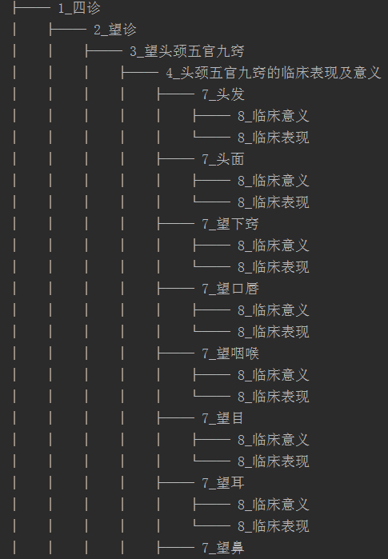

# textbook2tree
把教科书中的书本内容解释成树型结构。
### 环境安装
```
pip install treelib
```
### 使用说明
书本解释成树型结构
```angular2html
python tcm_book_diagnosis_tree.py
```
查看树型结构
```angular2html
python app.py
```
### 显示结果：


